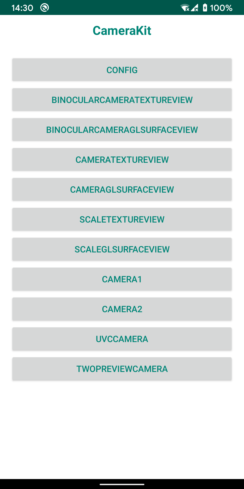
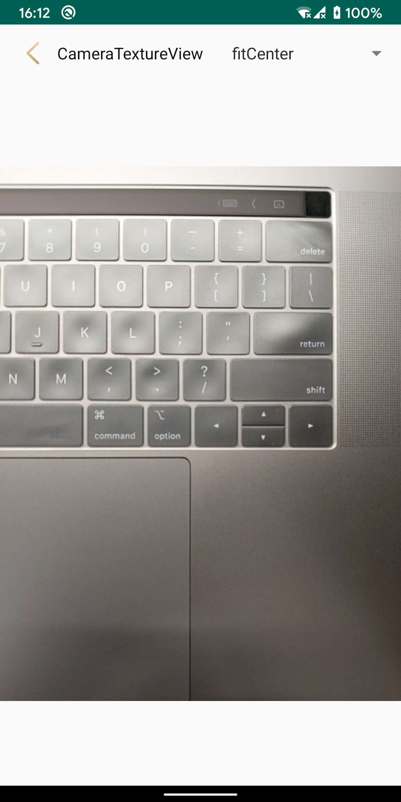

# CameraKit

## 介绍
    中文：
    1. 用于Android摄像头的通用API。已封装Camera1 Camera2, UvcCamera。
    2. 封装预览视图，基于CameraApi。已实现TextureView预览、GLSurfaceView预览、双目预览，预览界面可灵活配置图像、缩放、方向等参数。
    3. 简单的调用方式，节省开发者时间关注到具体业务和核心能力上。
    English:
    1. Common API for Android Camera. Has been encapsulated Camera1 Camera2, UvcCamera. 
    2. Encapsulate preview View, based on CameraApi. TextureView preview, GLSurfaceView preview, binocular preview can be implemented, and the preview interface can flexibly configure parameters such as image, Scale, and direction.
    3. Simple way to call, saves developers time，and focusing on specific business and core competencies.

## 项目架构

    ├── app                                         // sample
    ├── camerakit                                   // camera预览及相机能力整合
    ├── camera                                      // camera相机能力
    ├── libuvccamera                                // uvccamera辅助能力
    ├── repositories                                // 打包默认发版文件夹
    
## 截图

    
## API
    
### [camera API](./camera/README.md)
### [camerakit API](./camerakit/README.md)

## 感谢

### [CameraKit(https://github.com/CameraKit/camerakit-android)](https://github.com/CameraKit/camerakit-android)
### [saki4510t(https://github.com/saki4510t/UVCCamera)](https://github.com/saki4510t/UVCCamera)
### [Liuguihong(https://github.com/Liuguihong/AndroidUVCCamera)](https://github.com/Liuguihong/AndroidUVCCamera)
